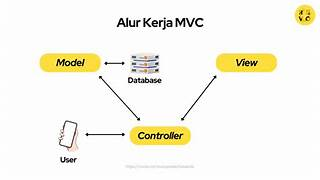

# Laporan Modul 1: Perkenalan Laravel
*Mata Kuliah:* Workshop Web Lanjut   
*Nama:* Kaisan Nurwaled  
*NIM:* 2024573010044
*Kelas:* TI-2C

---

## Abstrak 
Tuliskan ringkasan singkat tentang isi laporan ini dan tujuan Anda membuat laporan.

Tujuan dari laporan hari ini itu lebih ke mengulang masa lalu, padahal masa lalu itu dilupakan saya buruknya, cuma karna ini masalah yang baik dan ini itu ilmu, jadinya jangan dilupakan. Isi singkat dari laporan ini adalah mengenal lebih dalam tentang laravel, bukan hanya dari praktek menggunakan laravel saja, tapi teori tentang laravel yang initu jujur baru saya disuruh sekarang. 

---

## 1. Pendahuluan
- Tuliskan teori perkenalan tentang laravel
Laravel adalah framework PHP modern yang bisa digunakan untuk membangun aplikasi web dengan cepat, aman, dan terstruktur.

- Apa itu Laravel?
Laravel adalah framework PHP berbasis MVC (Model-View-Controller) yang digunakan untuk membangun aplikasi web secara cepat, aman, dan terstruktur dengan sintaks yang sederhana.

- Karakteristik utama (MVC, opinionated, dsb.)
Karakteristik Utama Laravel:
MVC (Model-View-Controller): Memisahkan logika aplikasi, tampilan, dan data.
Opinionated Framework: Menyediakan cara baku/standar dalam menulis kode sehingga lebih teratur.
Eloquent ORM: Mempermudah interaksi dengan database tanpa query SQL manual.
Blade Template Engine: Sistem templating bawaan untuk membuat tampilan dinamis.
Migration & Seeder: Mengatur struktur database secara versioning.
Middleware: Mengontrol request dan keamanan aplikasi.

- Untuk jenis aplikasi apa Laravel cocok?
Laravel cocok untuk jenis aplikasi:
Aplikasi Web,Sistem Manajemen, E-Commerce. 

---

## 2. Komponen Utama Laravel (ringkas)
Tuliskan penjelasan singkat (1–3 kalimat) untuk tiap komponen berikut:
- Blade (templating)
- Eloquent (ORM)
- Routing
- Controllers
- Migrations & Seeders
- Artisan CLI
- Testing (PHPUnit)
(Tambahkan komponen lain jika ingin)

Blade (templating): Engine templating milik Laravel yang memungkinkan membuat tampilan HTML dinamis dengan sintaks yang bersih dan mendukung inheritance dan komponen, kemudian dikompilasi ke PHP murni dan dicache untuk performa. 
Eloquent (ORM): Object-Relational Mapper di Laravel yang menghubungkan tiap tabel database dengan model PHP dan menyediakan cara yang nyaman untuk melakukan query, insert, update, delete serta relasi antar tabel. 
Routing: Sistem yang menentukan bagaimana aplikasi merespon request HTTP ke URI tertentu dengan menggunakan closure atau controller, termasuk parameter route, nama route, grup, middleware, dan binding ke model. 
Controllers: Kelas yang mengelompokkan logic pengolahan request HTTP (seperti menerima data, memanggil model, dan mengembalikan response) agar struktur aplikasi lebih rapi dan kode lebih terpisah. 
Migrations & Seeders: Migrations adalah sistem version control untuk skema database agar perubahan disimpan, dibagikan dan dapat di rollback; seeders adalah cara untuk mengisi database dengan data awal/pengujian. 
Artisan CLI: Command-line interface bawaan Laravel yang menyediakan banyak perintah untuk otomasi tugas pengembangan seperti membuat model, controller, migration, menjalankan server lokal, dan lain-lain. 
Testing (PHPUnit): Laravel menyediakan integrasi dengan PHPUnit (dan juga Pest) untuk membuat unit test, feature test, serta testing HTTP/database untuk memastikan aplikasi bekerja sesuai harapan dan mengurangi bug
Komponen tambahan (opsional):
Middleware: Lapisan perantara yang memproses request sebelum masuk ke aplikasi, misalnya untuk autentikasi atau proteksi CSRF.

---

## 3. Berikan penjelasan untuk setiap folder dan files yang ada didalam struktur sebuah project laravel.

Struktur Folder Laravel & Penjelasannya
1. app/
Berisi logika utama aplikasi.
Console/ → berisi perintah Artisan kustom.
Exceptions/ → konfigurasi dan handling error.
Http/ → berisi Controller, Middleware, dan Request.
Models/ → berisi model Eloquent untuk interaksi dengan database.
Providers/ → service provider, tempat mendaftarkan layanan/fitur Laravel.

2. bootstrap/
Berisi file yang menjalankan bootstrap framework Laravel, termasuk app.php untuk inisialisasi aplikasi. Ada juga folder cache/ untuk menyimpan cache konfigurasi.

3. config/
Kumpulan file konfigurasi aplikasi, misalnya app.php, database.php, mail.php, queue.php, dsb. Semua pengaturan Laravel ada di sini.

4. database/
Berisi hal-hal terkait database.
factories/ → membuat data dummy untuk testing.
migrations/ → file migrasi untuk struktur database.
seeders/ → file untuk mengisi data awal ke database.

5. public/
Folder yang diakses oleh user lewat web server.
Berisi index.php sebagai entry point Laravel.
Juga menyimpan file publik seperti CSS, JS, gambar.

6. resources/
Berisi resource aplikasi.
views/ → file Blade template untuk tampilan.
lang/ → file bahasa (localization).

js/ dan css/ → file frontend (kalau pakai Vite).

7. routes/
Tempat mendefinisikan route aplikasi.
web.php → route untuk halaman web (via browser).
api.php → route untuk API.
console.php → route untuk command Artisan.
channels.php → route untuk broadcasting.

8. storage/
Berisi file yang disimpan oleh aplikasi.
app/ → file aplikasi.
framework/ → cache, session, views yang dikompilasi.
logs/ → log aplikasi (misalnya error).

9. tests/
Berisi file untuk pengujian aplikasi.
Feature/ → testing level fitur (end-to-end).
Unit/ → testing level unit (logika kecil).

10. vendor/
Folder hasil instalasi Composer, berisi dependensi/library Laravel dan package lain. (Jangan diubah manual).

11. File penting di root project:
.env → konfigurasi environment (database, mail, app key, dll).
artisan → file untuk menjalankan perintah Artisan CLI.
composer.json → daftar dependency PHP (package Laravel).
package.json → daftar dependency JS (jika ada frontend build).
vite.config.js → konfigurasi Vite untuk asset bundling.
phpunit.xml → konfigurasi testing.

---

## 4. Diagram MVC dan Cara kerjanya

Umumnya alur kerja MVC yaitu controller berinteraksi dengan user, lalu meneruskan perintah user ke model untuk menampilkan data yang diminta. Selanjutnya model akan memberikan data tersebut ke controller agar ditampilkan oleh view. 
Misalnya, Andin membuka aplikasi Netflix di ponselnya, memilih menu Category di homepage dan mengeklik opsi “Romance”. Sistem app kemudian mengirimkan permintaan (request) kepada server Netflix untuk menampilkan daftar film ber-genre romantis. Server akan meneruskan permintaan tersebut kepada controller. 
Setelah permintaan diterima, controller akan berinteraksi dengan model untuk mengambil data tentang film romantis di database. Setelah data terkumpul, model akan mengirimkan data tersebut kembali ke controller. 
Controller mengirim data daftar film romantis ke view dan memintanya untuk melakukan proses rendering, atau menggabungkan beberapa objek agar bisa ditampilkan. 
Setelah data selesai dirender, view mengirimkannya kembali ke controller agar bisa ditampilkan pada tampilan aplikasi Netflix yang digunakan Andin. 

---

## 6. Kelebihan & Kekurangan (refleksi singkat)
- Kelebihan Laravel menurut Anda
- Hal yang mungkin menjadi tantangan bagi pemula

Kelebihan Laravel menurut saya:
Sintaks elegan dan mudah dibaca, sehingga kode lebih rapi.
Menggunakan arsitektur MVC yang memisahkan logika, tampilan, dan data.
Fitur bawaan lengkap: routing, Blade, Eloquent ORM, autentikasi, hingga API.
Dokumentasi resmi sangat lengkap dan komunitas besar, mudah mencari solusi.
Mendukung keamanan tinggi (CSRF, enkripsi password, proteksi SQL injection).

Hal yang mungkin menjadi tantangan bagi pemula:
Kurangnya dukungan built-in untuk arsitektur besar/enterprise atau multi-tenancy
Ketergantungan pada paket pihak ketiga
Seringnya pembaruan & isu kompatibilitas
Abstraksi dan overhead performa
Learning curve yang cukup curam

---

## 7. Referensi
Cantumkan sumber yang Anda baca (buku, artikel, dokumentasi) — minimal 2 sumber. Gunakan format sederhana (judul — URL).
Laravel -https://laravel.com/docs/12.x/blade
What are the Advantages and Disadvantages of Using Laravel Framework? – https://configs.in/support/knowledge-base/article/what-are-the-advantages-and-disadvantages-of-using-laravel-framework
Disadvantages of Laravel (2024) – https://courseya.com/disadvantages-of-laravel/
gambar mvc-https://www.revou.co/id/kosakata/mvc

---