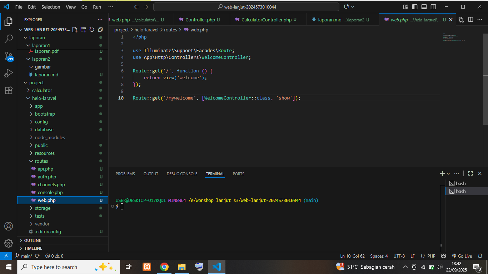

# Laporan Modul 2: Laravel Fundamentasl
**Mata Kuliah:** Workshop Web Lanjut   
**Nama:** Kaisan Nurwaled  
**NIM:** 2024573010044
**Kelas:** TI-2C

---

## Abstrak 
Tuliskan ringkasan singkat tentang isi laporan ini dan tujuan Anda membuat laporan.

Jadi laporan kali ini membahas Route, Controller, dan Blade View, jadi saya lebih paham akan hal-hal yang dibahas ituu,, dan juga kami disuruh buat proyek baru, yaitu membuat kalkulator sederhana, dan alhamdulillah berhasil. Setelah itu saya membuat prak 3 yang disuruh mencari tau lebih dalam tentang MVC, Route, Controller, dll. Tujuan dibuatnya laporan ini pastinya untuk mengenal lebih dalam sehingga lebih memahami tentang apa yang dipelari, bukan hanya sekedar mengenal tetapi lebih mendalami sehingga lebih memahami.

---

## 1. Dasar Teori
- Apa itu MVC (Model, View, Controller).

MVC itu cara kerja aplikasi yang dibagi jadi tiga bagian:
Model: mengurus data (misalnya ambil, simpan, hapus).
View: menampilkan tampilan ke pengguna.
Controller: penghubung antara data (Model) dan tampilan (View).

- Konsep Routing di Laravel.

Routing adalah jalan atau peta yang menghubungkan alamat web (URL) ke apa yang harus dijalankan di aplikasi.
Contoh: saat buka /calculator, Laravel akan tahu harus menampilkan halaman kalkulator.

- Fungsi Middleware.

Middleware itu seperti “penjaga pintu”.
Sebelum masuk ke halaman tertentu, request akan dicek dulu. Misalnya:
Apakah sudah login?
Apakah punya izin khusus?

- Bagaimana cara Laravel menangani Request dan Response.

Saat pengguna buka halaman, Laravel terima request.
Laravel cek aturan (middleware, routing).
Data diambil/diolah oleh controller & model.
Hasilnya dikirim balik ke pengguna dalam bentuk response (misalnya halaman HTML).
- Peran Controller dan View.

Controller: otaknya aplikasi, mengatur logika dan jalan cerita.
View: wajah aplikasi, yaitu tampilan yang dilihat pengguna.

- Fungsi Blade Templating Engine.

Blade itu alat untuk bikin tampilan di Laravel supaya lebih rapi dan mudah.
Dengan Blade:
Bisa pakai template yang sama di banyak halaman.
Bisa pakai @if, @foreach untuk logika sederhana di tampilan.
Tulisannya lebih singkat dibanding PHP biasa

---

## 2. Langkah-Langkah Praktikum
Tuliskan langkah-langkah yang sudah dilakukan, sertakan potongan kode dan screenshot hasil.

2.1 Praktikum 1 – Route, Controller, dan Blade View

- Tambahkan route pada routes/web.php.

Pertama-tama, menambahkan routes baru pada web.php, ini berfungsi untuk menghubungkan URL dengan fungsi yang ada pada controller.

- Buat controller WelcomeController.

Selanjutnya saya membuat controller baru dengan perintah: php artisan make:controller WelcomeController

- Buat view mywelcome.blade.php.

Selanjutnya saya membuat file view bernama mywelcome.blade.php di folder resources/views.

- Jalankan aplikasi dan tunjukkan hasil di browser.

Screenshot Hasil:

2.2 Praktikum 2 – Membuat Aplikasi Sederhana "Calculator"

- Tambahkan route untuk kalkulator.

Saya menambahkan route baru di routes/web.php untuk mengakses kalkulator:

- Buat controller CalculatorController.

Selanjutnya saya membuat controller baru dengan perintah: php artisan make:controller WelcomeController
 

- Tambahkan view calculator.blade.php.

Saya membuat file resources/views/calculator.blade.php dengan isi:
 

- Jalankan aplikasi dan coba dengan beberapa input berbeda.

Saya menjalankan aplikasi dengan perintah: cd project, cd calculator, php artisan serve.

Screenshot Hasil:
 

 

---

## 3. Hasil dan Pembahasan
Jelaskan apa hasil dari praktikum yang dilakukan.

- Apakah aplikasi berjalan sesuai harapan?

Aplikasi kalkulator sederhana berhasil dijalankan. Ketika dimasukkan angka dan memilih operasi hitung, hasil perhitungan dapat ditampilkan di browser mau itu tambah(+), kurang(-), kali(*), bagi(/).

- Apa yang terjadi jika ada input yang salah (misalnya pembagian dengan 0)?

Misalnya dibagian dengan angka 0, maka aplikasi menampilkan pesan Error agar tidak terjadi kesalahan perhitungan.

- Bagaimana validasi input bekerja di Laravel?

Validasi input dapat dilakukan dengan Request atau fungsi validate() untuk memastikan data yang masuk sesuai aturan, misalnya angka harus diisi dan tidak boleh kosong. Dengan validasi ini, aplikasi lebih aman dari input yang tidak sesuai.

- Apa peran masing-masing komponen (Route, Controller, View) dalam program yang dibuat?

Route: mengatur alamat URL yang mengarah ke fungsi tertentu.
Controller: tempat logika program dijalankan (proses perhitungan).
View: menampilkan hasil ke pengguna dalam bentuk halaman web.

---

## 4. Kesimpulan

Tulis kesimpulan dari praktikum ini

Dari praktikum ini dapat disimpulkan bahwa Laravel mempermudah pembuatan aplikasi web dengan konsep MVC (Model-View-Controller). Route digunakan untuk mengatur alur halaman, Controller berfungsi mengolah logika aplikasi, dan View menampilkan hasil ke pengguna. Aplikasi kalkulator sederhana yang dibuat sudah berjalan sesuai harapan, termasuk menangani input yang tidak valid seperti pembagian dengan nol.

---

## 5. Referensi
Cantumkan sumber yang Anda baca (buku, artikel, dokumentasi) — minimal 2 sumber. Gunakan format sederhana (judul — URL).

Laravel Documentation — https://laravel.com/docs
Tutorialspoint: Laravel — https://www.tutorialspoint.com/laravel
W3Schools Laravel Tutorial — https://www.w3schools.com/laravel

---